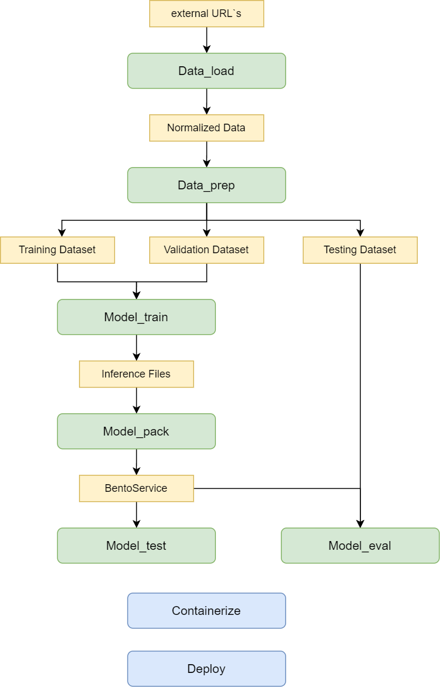

# Rest CV-Pipeline 

The REST CV Pipeline scenario involves using a machine learning model along with BentoService (BentoML), which provides REST API functionality.

In this REST CV Pipeline scenario, we want to use the SinaraML Framework to illustrate the possibility of creating a full cycle of model training:
from preparing data for training to transferring the trained model to the production environment as a service with a REST API.     
This provides simplicity and convenience in working with data and models, and also provides the ability to easily transfer the model from one environment to another. Once the service is deployed, we can use it to get predictions from the trained model. We can send API requests with input data and receive responses with model predictions. This allows the model to be used in real time in applications or systems where image analysis is required.

If the model needs to be updated, we can repeat the process of training, saving and deploying using SinaraML and BentoML.
This allows you to quickly and easily update the model in a production environment without interrupting system operation.

This scenario uses the mmdetection framework, which provides an implementation of various computer vision algorithms, including YOLOX_S. The original YOLOX_S model has already been trained on the full COCO dataset, however, in order to further improve its performance and adapt to specific requirements, additional training is being conducted on a part of the COCO validation sample.   

To retrain the model, a part of the COCO validation sample is used, which is a subset of the data from the full dataset. This reduces the amount of data and speeds up the learning process. As a result of further training, the model will be better adapted to specific tasks and data, which will lead to increased accuracy and performance.  

  
  
&nbsp;

  

    <b>High Concept Binary CV-Pipeline</b>
  

  
&nbsp;

# Description of step Rest CV-Pipeline
## **Data_load**
### Component logic:
Data_Load is a component of the CV Pipeline, which is responsible for uploading data to the analytical repository. It performs two main functions: uploading external raw data to the platform to convert it into the correct versioned storage structure.    
When uploading data, CV Pipeline extracts this data and prepares it for further processing. This includes converting data formats, converting markup.    
In addition, CV Pipeline also allows you to upload external raw data to the platform. This data can be obtained from various sources, such as files, databases, or APIs. After the CV is loaded, Pipeline converts this data into the correct storage structure, taking into account the versioning requirements. This ensures that the data is saved and available for later analysis and use.      
In general, CV Pipeline plays an important role in the data processing process, ensuring that it is properly loaded and converted into a versioned analytical storage structure. This allows effective data management and provides a reliable basis for subsequent analysis and use of information.
### Interface (input, output):
- Input:
Raw data: different sources, different annotations, external sources
- Output:
Normalized data: with the correct structure for storage in the repository
_____________________________________________
## **Data_prep**
### Component logic:
At the CV Pipeline Data_Prep stage, the data is carefully analyzed and processed to ensure its quality and suitability for future use. The following steps are performed in this process:    
1. Validation: The dataset is checked for errors or inconsistencies. For example, it checks whether there are negative coordinates or omissions in the markup. If such problems are found, they are fixed or deleted.    
2. Markup conversion: If the data markup requires changes or additions, it is converted accordingly. For example, you may need to reclassify objects or add new labels.    
3. Separation of samples: The data set is divided into separate subsets: training, validation and testing datasets. The training set is used to train the model, the validation set is used to set up hyperparameters and evaluate the performance of the model during training, and the test set is used for the final evaluation of the model after training.     
4. Data viewing and processing: Visual data analysis allows you to get an idea of the characteristics of a dataset. For example, class distribution histograms are built to assess class balance and identify possible problems. It may also be useful to consider visual markup examples to better understand the data and possible challenges when training the model.     
### Interface (input, output):
- Input:
Normalized data (obtained from the previous step CV Pipeline - Data_Load)
- Output:
Correct data (data that is suitable for training and testing the trained model)
_____________________________________________
## **Model_train**
### Component logic:
At this stage, the model is trained using the training and validation datasets created at the data_prep component stage.    
To transfer to the following components, weights from the last epoch and the epoch with the best metric are copied. We also copy one of the images of the validation dataset to the directory with the trained model for subsequent tests.    
### Interface (input, output):
- Input:
Training and validation datasets (obtained from the previous step CV Pipeline - Data_Prep)    
Model learning parameters (number of epochs, learning rate, batch size, etc.)   
- Output:
Inference files (A model in the Pytorch format) (weights from the last epoch of learning and with the best metrics)  
_____________________________________________
## **Model_pack**
### Component logic:
At the CV Pipeline Model_Pack stage, the following steps occur:    
1. Model conversion    
- The model trained at the previous stage of the CV-Pipeline Model_Train is converted to a format corresponding to certain scenarios. For example, if the CV-Pipeline REST script is selected, the model can be converted to ONNX format, which provides the ability to deploy the model as a REST service.
2. Packaging in bertoservice    
After converting the model, the model weights and all necessary artifacts (for example, the test image, the predicates of the test image) are packaged in bentoservice. Packaging in bentoservice allows you to create a containerized application that can be easily deployed and used for inference (prediction) on new data.    
### Interface (input, output):
- Input:
Inference files (model) (obtained from the previous step CV Pipeline - Model_Train)
- Output:
The BentoService model
_____________________________________________
## **Model_eval**
### Component logic:
This stage of the CV Pipeline Model_Eval provides testing of the model, evaluating its performance, saving predicates for further analysis, and visualizing the results using metrics and graphs.   
### Interface (input, output):
- Input:
Test dataset (obtained from the CV Pipeline - Data_Prep step)    
The model in Bertoservice (obtained from the previous step CV Pipeline - Model_Pack)    
- Output:
Model Quality Report
_____________________________________________
## **Model_test**
### Component logic:
At this stage, CV Pipeline Model_Test tests the packaged BentoML service, which contains the model and other necessary artifacts.
May contain several tests and examples of calling BentoML REST API methods:
1. Launch test of packaged bentoservice and test image predictor
     - Launching the BentoML service (obtained from the Model_Pack component) to process images and obtain predictors
     - Obtaining a test image and the saved result of processing the test image (must be in the bentoservice artifacts) through the REST API methods of the BentoML service
       The previously saved processing result on the test image is used as a reference value.
     - Prediction of a test image via the REST API of the BentoML service
     - Comparison of the test image predictor with the saved test result. May involve comparing values or other characteristics of a predictor with reference values.
2. Load test, when for a specified time there is a sequential call to the REST API predict method on a test image.
    This test allows you to evaluate the performance of the BentoML model and service when processing a large number of requests. 
### Interface (input, output):
- Input:
Bertoservice (obtained from the previous step CV Pipeline - Model_Pack)    
_____________________________________________

