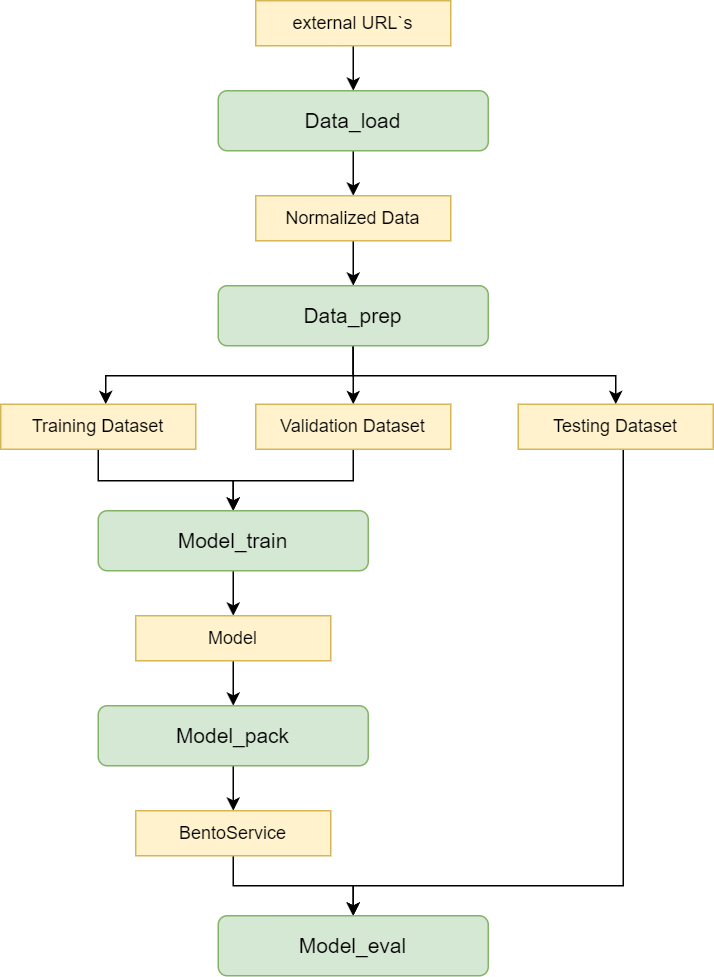

# Binary CV-Pipeline

CV или ML Pipeline - это последовательность шагов (step), которые выполняются для обработки данных и обучения модели машинного обучения. 
Основная цель CV&ML Pipeline - автоматизировать и стандартизировать процесс обработки данных и обучения модели. Pipeline включает в себя различные этапы, такие как предобработка данных, извлечение признаков, обучение модели, оценка ее производительности и т. д. При этом  каждый шаг в pipeline может быть настроен и оптимизирован независимо от других, что делает pipeline гибким и масштабируемым. Это позволяет эффективно управлять всем процессом - автоматизировать и стандартизировать процесс обработки данных и обучения моделей. А также способствует повторяемости и воспроизводимости результатов, что является важным аспектом в машинном обучении.  

Binary CV Pipeline представляет собой сценарий, при котором требуется передать модель, обученную в фреймворке PyTorch, в исходном виде. В данном примере модель YOLOX_S из mmdetection дообучается на части валидационной выборки COCO датасета.

В рамках этого сценария используется фреймворк mmdetection, который предоставляет реализацию различных алгоритмов компьютерного зрения, включая YOLOX_S. Исходная модель YOLOX_S уже обучена на полном COCO датасете, однако для дальнейшего улучшения ее производительности и адаптации к конкретным требованиям, проводится дообучение на части валидационной выборки COCO.

Для дообучения модели используется часть валидационной выборки COCO, которая представляет собой подмножество данных из полного датасета. Это позволяет сократить объем данных и ускорить процесс дообучения. В результате дообучения модель будет лучше адаптирована к конкретным задачам и данным, что приведет к повышению ее точности и производительности.

<div align="center">
  
  <div>&nbsp;</div>
  <div align="center">
    <b><font size="3">Структура Binary CV-Pipeline</font></b>
  </div>
  <div>&nbsp;</div>
</div>

# Описание step Binary CV-Pipeline
## Data_load
### Логика компонента:
  Data_Load - это компонент CV Pipeline, который отвечает за загрузку данных в аналитическое хранилище. Он выполняет две основные функции: загрузку внешних необработанных данных на платформу для их преобразования в правильную структуру хранилища с версионированием.     
  При загрузке данных CV Pipeline извлекает эти данные и подготавливает их для дальнейшей обработки. Это включает в себя преобразование форматов данных, преобразование разметки.    
  Кроме того, CV Pipeline также позволяет загружать внешние необработанные данные на платформу. Эти данные могут быть получены из различных источников, таких как файлы, базы данных или API. После загрузки CV Pipeline преобразует эти данные в правильную структуру хранилища с учетом требований к версионированию. Это гарантирует, что данные будут сохранены и доступны для последующего анализа и использования.    
  В целом, CV Pipeline играет важную роль в процессе обработки данных, обеспечивая их правильную загрузку и преобразование в структуру аналитического хранилища с версионированием. Это позволяет эффективно управлять данными и обеспечивает надежную основу для последующего анализа и использования информации.
### Interface (вход, выход):
- Вход:
Данные необработанные: различные источники, различная разметка, внешние источники
- Выход:
Нормализованные данные: с правильной структурой для хранения в хранилище
_____________________________________________
## Data_prep
### Логика компонента:
На этапе CV Pipeline Data_Prep происходит тщательный анализ и обработка данных, чтобы гарантировать их качество и пригодность для дальнейшего использования. В этом процессе выполняются следующие шаги:
1. Проверка на корректность: Набор данных проходит проверку на наличие ошибок или несоответствий. Например, проверяется, есть ли отрицательные координаты или пропуски в разметке. Если такие проблемы обнаруживаются, они исправляются или удаляются.
2. Преобразование разметки: Если разметка данных требует изменений или дополнений, она преобразуется соответствующим образом. Например, может потребоваться переклассифицировать объекты или добавить новые метки.
3. Разделение выборок: Набор данных разделяется на отдельные подмножества: тренировочный, валидационный и тестировочный датасеты. Тренировочный набор используется для обучения модели, валидационный набор - для настройки гиперпараметров и оценки производительности модели в процессе обучения, а тестовый набор - для окончательной оценки модели после обучения.
4. Просмотр и обработка данных: Визуальный анализ данных позволяет получить представление о характеристиках набора данных. Например, строятся гистограммы распределения классов для оценки баланса классов и выявления возможных проблем. Также может быть полезно рассмотреть визуальные примеры разметки для лучшего понимания данных и возможных вызовов при обучении модели.
### Interface (вход, выход):
- Вход:
Нормализованные данные (полученные с предыдущего шага CV Pipeline - Data_Load)
- Выход:
Корректные данные (данные которые годятся для тренировки и тестирования обучаемой модели)
_____________________________________________
## Model_train
### Логика компонента:
На этом этапе модель обучается с использованием тренировочного и валидационного датасетов, созданных на этапе компоненты data_prep.
Для передачи в следующие компоненты - копируются веса с последней эпохи и эпохи с наилучшей метрики. Также копируем одно из изображений валидационного датасета, в директорию с обученной моделью, для последующих тестов.
### Interface (вход, выход):
- Вход:
Тренировочный и валидационный датасеты (полученные с предыдущего шага CV Pipeline - Data_Prep)
Параметры обучения модели (число эпох, learning rate, размер батча и т.д.)
- Выход:     
Модель в формате PyTorch (веса с последней эпохи обучения и с наилучшими метриками)     
_____________________________________________
## Model_pack
### Логика компонента:
На этапе CV Pipeline Model_Pack происходит следующие шаги:
1. Конвертация модели
   - Модель, обученная на предыдущем этапе CV-Pipeline Model_Train, конвертируется в формат, соответствующий определенным сценариям. Например, если выбран сценарий REST CV-Pipeline, модель может быть конвертирована в формат ONNX, который обеспечивает возможность развертывания модели в виде REST-сервиса. В случае сценария Binary CV-Pipeline, модель может быть передана в формате PyTorch или другом формате, в котором она была обучена.
2. Упаковка в bentoservice
   - После конвертации модели, веса модели и все необходимые артефакты (например, тестовое изображение, предикты по тестовому изображению) упаковываются в bentoservice. Упаковка в bentoservice позволяет создать контейнеризированное приложение, которое может быть легко развернуто и использовано для инференса (предсказания) на новых данных.

### Interface (вход, выход):
- Вход:
Модель  (полученные с предыдущего шага CV Pipeline - Model_Train)
- Выход:
Модель в виде BentoService
_____________________________________________
## Model_eval
### Логика компонента:
Этот этап CV Pipeline Model_Eval  обеспечивает тестирование модели, оценку ее производительности, сохранение предиктов для дальнейшего анализа и визуализацию результатов с помощью метрик и графиков. 
### Interface (вход, выход):
- Вход:
Тестовый датасет (полученный с  шага CV Pipeline - Data_Prep)
Модель в BentoService (полученные с предыдущего шага CV Pipeline - Model_Pack)
- Выход:
Отчёт о качестве модели
_____________________________________________
_____________________________________________
# Step CV-Pipeline: data_load [EN](README.md)

Данный компонент CV(computer vision) пайплайна отвечает за загрузку данных из различных источников. Этот компонент обеспечивает получение и подготовку данных для дальнейшей обработки и анализа.    
Включает в себя следующие этапы:     
- Выбор источника данных: Этот этап включает выбор источника, из которого необходимо загрузить данные.   
Источниками могут быть файлы изображений или видео.     
- Получение данных: После выбора источника выполняются операции для получения данных из выбранного источника.        
Например, для файлов изображений или видео это может быть операция копирования файлов с диска или загрузка датасета с внешнего источника. 
- Преобразование данных. На данном этапе преобразуются данные из нестандартного формата в стандартный формат платформы SinaraML 
- Передача данных в следующий шаг пайплайна: После загрузки и подготовки данных, данный этап cv pipeline передает их в следующий шаг pipeline, который включает другие операции анализа, обработки и подготовки данных для обучения.

В данном примере загружается датасет [`COCO`](http://images.cocodataset.org/).   
Для более быстрого запуска и прогона cv-pipeline используем валидационную часть датасета (~1 Гб)
http://images.cocodataset.org/zips/val2017.zip
и аннотации к ним http://images.cocodataset.org/annotations/annotations_trainval2017.zip          
    
Выходом работы данного step CV-Pipeline является два urls внешнего хранилища
- **coco_datasets_images**     
изображения скачанного датасета
- **coco_datasets_annotations**    
файлы аннотации скачанного датасета
- **yolox_pth_pretrain_weights**
предтренировочные веса

## Как запустить шаг CV-Pipeline: data_load

### Создать директорию для проекта (или использовать уже существующую)
```
mkdir obj_detect_binary
cd obj_detect_binary
```  

### склонировать репозиторий data_load
```
git clone --recurse-submodules https://github.com/4-DS/obj_detect_binary-data_load.git {dir_for_data_load}
cd {dir_for_data_load}
```  

### запустить шаг CV-Pipeline:data_load в режиме dev, а затем в режиме prod
```
python step.dev.py
python step.prod.py
``` 