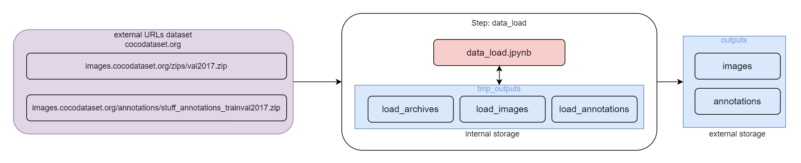

# Step CV-Pipeline: data_load [EN](README.md)

Данный компонент CV(computer vision) пайплайна отвечает за загрузку данных из различных источников. Этот компонент обеспечивает получение и подготовку данных для дальнейшей обработки и анализа.    
Включает в себя следующие этапы:     
- Выбор источника данных: Этот этап включает выбор источника, из которого необходимо загрузить данные.   
Источниками могут быть файлы изображений или видео.     
- Получение данных: После выбора источника выполняются операции для получения данных из выбранного источника.        
Например, для файлов изображений или видео это может быть операция копирования файлов с диска или загрузка датасета с внешнего источника. 
- Преобразование данных. На данном этапе преобразуются данные из нестандартного формата в стандартный формат платформы SinaraML 
- Передача данных в следующий шаг пайплайна: После загрузки и подготовки данных, данный этап cv pipeline передает их в следующий шаг pipeline, который включает другие операции анализа, обработки и подготовки данных для обучения.

В данном примере загружается датасет [`COCO`](http://images.cocodataset.org/).   
Для более быстрого запуска и прогона cv-pipeline используем валидационную часть датасета (~1 Гб)
http://images.cocodataset.org/zips/val2017.zip
и аннотации к ним http://images.cocodataset.org/annotations/annotations_trainval2017.zip          

    
Данный компонент создается из [шаблона](https://github.com/4-DS/step_template).
Чтобы не забывать про обязательные ячейки в каждом ноутбуке, проще всего создавать новые ноутбуки просто копированием [`substep_full.ipynb`](https://github.com/4-DS/step_template/blob/main/substep_full.ipynb) из стандартного [шаблона](https://github.com/4-DS/step_template) компоненты.
    
Конечным выходом работы данного step CV-Pipeline является два urls внешнего хранилища
- **images**     
изображения скачанного датасета
- **annotations**    
файлы аннотации скачанного датасета

## Как запустить шаг CV-Pipeline: data_load

### Создать директорию для проекта (или использовать уже существующую)
```
mkdir obj_detect_binary
cd obj_detect_binary
```  

### склонировать репозиторий data_load
```
git clone --recurse-submodules https://github.com/4-DS/obj_detect_binary-data_load.git {dir_for_data_load}
cd {dir_for_data_load}
```  

### запустить шаг CV-Pipeline:data_load в режиме dev, а затем в режиме prod
```
python step.dev.py
python step.prod.py
``` 